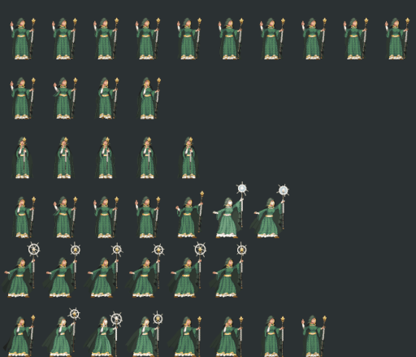

Spriteflip
==========
[GIMP](https://www.gimp.org/) plugin to flip regions of an image horizontally
or vertically. Useful for creating reversed spritesheets.

How to use
----------
1. **The image should be in a single layer before running this tool**.
2. Open the Spriteflip menu `Tools->Transform Tools->Spriteflip`
3. Input the width and height of each sprite frame in pixels
4. Select a horizontal (default) or vertical transformation
5. Click OK

Install
-------
Save `spriteflip.scm` in your GIMP scripts directory. On Linux I ran this command to find it:

    find ~/ -name scripts -type d 2>/dev/null | grep -i gimp

Start GIMP or if its already running go to `Filters->Script-Fu->Refresh Scripts`.

Find Spriteflip under `Tools->Transform Tools`.

License
-------
Copyright 2021 David Farrell

This program is free software: you can redistribute it and/or modify
it under the terms of the GNU General Public License as published by
the Free Software Foundation; either version 3 of the License, or
(at your option) any later version.

This program is distributed in the hope that it will be useful,
but WITHOUT ANY WARRANTY; without even the implied warranty of
MERCHANTABILITY or FITNESS FOR A PARTICULAR PURPOSE.  See the
GNU General Public License for more details.

You should have received a copy of the GNU General Public License
along with this program.  If not, see <https://www.gnu.org/licenses/>.
